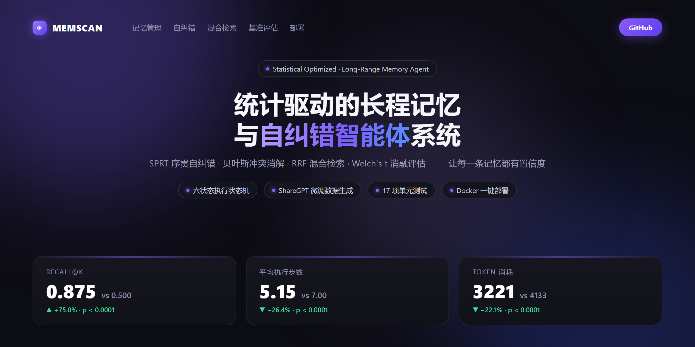
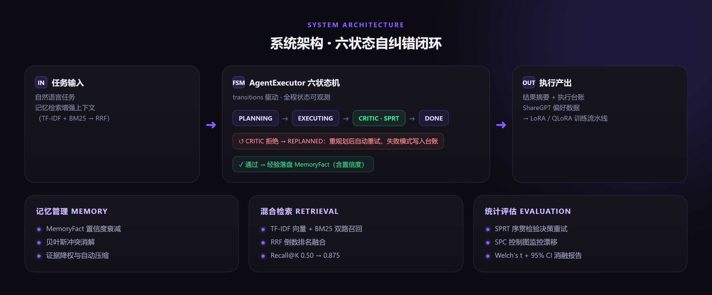
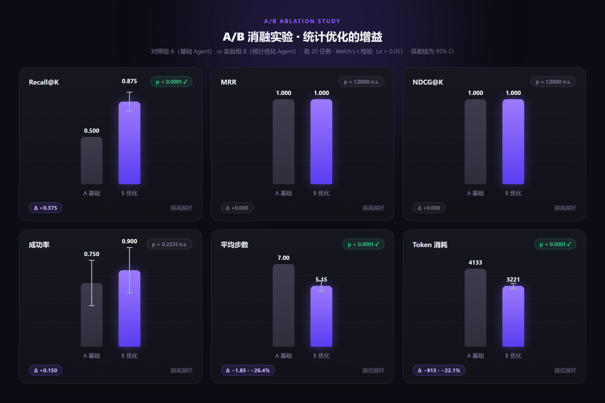
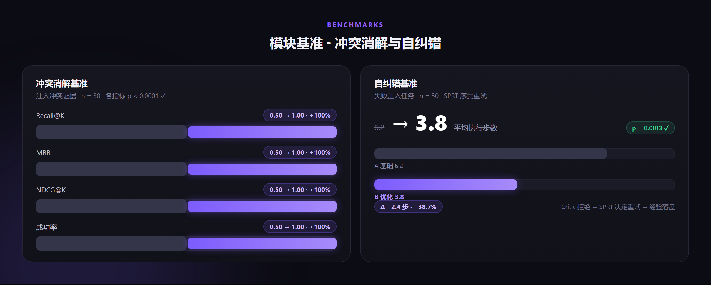

# MEMSCAN · 统计优化长程记忆与自纠错智能体系统

<p align="center">
  
</p>

以统计学方法（SPRT 序贯检验、SPC 统计过程控制、贝叶斯冲突消解、混合检索 RRF 融合）优化 LLM 智能体的长程记忆与任务执行自纠错能力，并提供完整的 A/B 消融实验评估。

## ✨ 核心特性

- **六状态执行状态机**（`transitions` 驱动）：规划 → 执行 → Critic 验证 → 失败自动重规划，全程状态可观测
- **SPRT/SPC 自纠错**：Critic 拒绝后基于序贯概率比检验决定重试与终止策略，失败模式落盘为台账
- **统计化记忆管理**：MemoryFact 携带置信度，冲突消解采用指数衰减 + 贝叶斯更新，过期证据自动降权
- **混合检索**：TF-IDF 向量 + BM25 双路召回，RRF（Reciprocal Rank Fusion）融合排序
- **微调数据生成**：高质量执行轨迹一键导出 ShareGPT 格式偏好对，可直接对接 LoRA/QLoRA 训练流水线
- **A/B 消融评估**：Welch's t 检验 + 95% CI，量化统计优化模块的增益

## 🏗 系统架构

<p align="center">
  
</p>

## 📊 A/B 消融实验（20 任务 × 2 组）

<p align="center">
  
</p>

| 指标 | 基础 Agent | 统计优化 Agent | Δ | p 值 | 显著 |
|------|-----------|---------------|---|------|------|
| Recall@K | 0.500 | **0.875** | +0.375 | <0.0001 | ✓ |
| 平均步数 | 7.00 | **5.15** | −1.85 | <0.0001 | ✓ |
| Token 消耗 | 4133 | **3221** | −913 | <0.0001 | ✓ |
| 成功率 | 0.750 | 0.900 | +0.150 | 0.223 | ✗ |

> 完整实验设计说明见 [`evaluation/report.md`](evaluation/report.md)

## 🧪 模块基准

<p align="center">
  
</p>

- **冲突消解基准**（n = 30）：注入冲突证据后，贝叶斯消解 + 指数衰减使 Recall@K / MRR / NDCG@K / 成功率 全部从 0.50 提升至 1.00（p < 0.0001）
- **自纠错基准**（n = 30）：失败注入任务中，SPRT 序贯重试策略将平均执行步数从 6.2 降至 3.8（−38.7%，p = 0.0013）

## 🚀 快速开始

```bash
pip install -r requirements.txt

# Web 演示界面（Streamlit）
streamlit run app.py --server.port 8765

# FastAPI 服务
python main.py            # http://127.0.0.1:8000/docs
```

演示界面内置"演示自纠错"开关：勾选后下发的第一个子任务会被 Critic 拒绝，可现场观察「失败 → 自动重规划 → 经验落盘 → 微调数据生成」完整闭环。

## 📁 项目结构

```
app/
  agent/        AgentExecutor 状态机与规划器
  memory/       MemoryManager / MemoryFact / 冲突消解
  retrieval/    混合检索（RRF 融合）
  evaluation/   metrics（Welch t / SPRT / SPC）
  api/          FastAPI 路由
deployment/     Dockerfile / docker-compose / LoRA 适配器合并
evaluation/     A/B 消融实验报告与图表
assets/         README 可视化图表
data/           演示场景与 ShareGPT 偏好数据样例
tests/          17 个单元测试模块
```

## 🧭 运行测试

```bash
pytest tests/ -v
```

## 🐳 部署

```bash
cd deployment
docker-compose up -d
```
