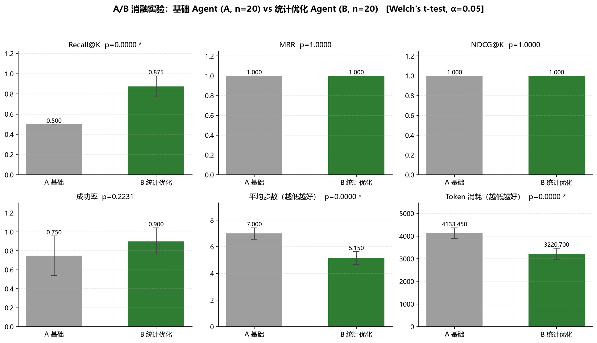

# A/B 消融实验评估报告

- **生成时间**: 2026-09-16 03:46 UTC
- **对照组 A**（无统计优化的基础 Agent）: 20 个任务
- **实验组 B**（统计优化 Agent：SPC/SPRT 自纠错 + 贝叶斯冲突消解 + 混合检索）: 20 个任务
- **检验方法**: Welch's t 检验（独立样本，双侧），显著性水平 α = 0.05
- **置信区间**: 均值差 (B − A) 的 95% CI（Welch–Satterthwaite 自由度）

## 指标对比

| 指标 | A 均值 | B 均值 | Δ (B−A) | t 统计量 | P 值 | 95% CI | 显著 | 方向 |
|------|--------|--------|---------|----------|------|--------|------|------|
| Recall@K | 0.5000 | 0.8750 | +0.3750 | 7.550 | 0.0000 | [+0.2710, +0.4790] | ✓ | 越高越好 |
| MRR | 1.0000 | 1.0000 | +0.0000 | 0.000 | 1.0000 | [+0.0000, +0.0000] | ✗ | 越高越好 |
| NDCG@K | 1.0000 | 1.0000 | +0.0000 | 0.000 | 1.0000 | [+0.0000, +0.0000] | ✗ | 越高越好 |
| 成功率 | 0.7500 | 0.9000 | +0.1500 | 1.241 | 0.2231 | [-0.0956, +0.3956] | ✗ | 越高越好 |
| 平均步数 | 7.0000 | 5.1500 | -1.8500 | -5.965 | 0.0000 | [-2.4782, -1.2218] | ✓ | 越低越好 |
| Token 消耗 | 4133.4500 | 3220.7000 | -912.7500 | -5.595 | 0.0000 | [-1243.0400, -582.4600] | ✓ | 越低越好 |

## 结论

**统计优化（B 组）带来显著改善的指标：**

- **Recall@K**: 0.5000 → 0.8750（Δ = +0.3750，95% CI [+0.2710, +0.4790]，p = 0.0000）
- **平均步数**: 7.0000 → 5.1500（Δ = -1.8500，95% CI [-2.4782, -1.2218]，p = 0.0000）
- **Token 消耗**: 4133.4500 → 3220.7000（Δ = -912.7500，95% CI [-1243.0400, -582.4600]，p = 0.0000）

## 实验设计说明

- **记忆模块指标**（Recall@K / MRR / NDCG@K）：基于 ground truth 相关记忆集合与系统召回排序的对照评估，逐任务计算后取均值；
- **任务模块指标**（成功率 / 平均步数）：成功率按 0/1 二元变量处理，步数为实际执行的子任务数；
- **效率模块指标**（Token 消耗）：含规划、执行、Critic 验证、Replan 的全部消耗；
- 成功率为二元变量，t 检验为其近似方案（严格应 Fisher 精确检验）；其余连续指标在独立样本假设下 Welch's t 检验是稳健选择。

